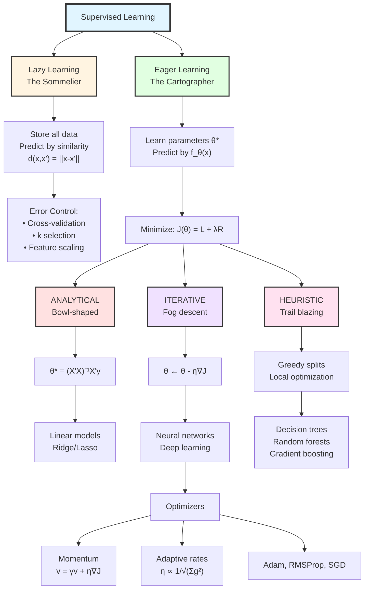

# Supervised Learning: A Unified Framework from First Principles

## The Fundamental Question

Let's step back to the absolute foundation. Every supervised learning algorithm is trying to solve the same problem:

> **Given observations $(x_i, y_i)$ from some unknown data-generating process, find a function $\hat{f}$ that predicts $y$ for new, unseen $x$ values.**

The differences between algorithms come down to three choices:

1. **What family of functions do we consider?** (model class)
2. **How do we measure prediction quality?** (loss function)
3. **How do we search for the best function?** (optimization method)

Everything else—regularization, cross-validation, feature engineering—serves to make this core process work better.

---

## Part 1: The Two Philosophies of Learning

### Lazy Learning: The Wine Expert with Perfect Memory

Imagine a sommelier who has tasted 10,000 wines over 30 years and remembers every single one—the vintage, the terroir, the tasting notes, the rating. When someone brings a new wine, she doesn't consult a rulebook. She swirls, sniffs, sips, and thinks: *"The tannin structure reminds me of that 2015 Pauillac… but the fruit profile is more like the 2018 Brunello I had in Montalcino… and there's an earthiness like that Oregon Pinot from Willamette Valley."*

She makes her judgment by **finding similar experiences and aggregating their outcomes**.

This is lazy learning: **no abstraction, no rules, just memory and analogy**.

**Core assumption**: Similar inputs should produce similar outputs.

**The mathematical formulation**: For a query point $x_q$, find the $k$ nearest neighbors $\mathcal{N}_k(x_q)$ and aggregate:

$$\hat{y} = \frac{1}{k}\sum_{x_i \in \mathcal{N}_k(x_q)} y_i \quad \text{(regression)}$$

$$\hat{y} = \text{mode}\{y_i : x_i \in \mathcal{N}_k(x_q)\} \quad \text{(classification)}$$

**The critical design choice**: What does "similar" mean? For our sommelier, similarity might weight grape varietal heavily, terroir moderately, and vintage year lightly. Mathematically, this is encoded in the **distance metric**:

$$d_{\text{Euclidean}}(x, x') = \sqrt{\sum_{j=1}^{p}(x_j - x'_j)^2}$$

$$d_{\text{Minkowski}}(x, x') = \left(\sum_{j=1}^{p}|x_j - x'_j|^m\right)^{1/m}$$

$$d_{\text{weighted}}(x, x') = \sqrt{\sum_{j=1}^{p}w_j(x_j - x'_j)^2}$$

The choice of metric and weights fundamentally shapes what "similar" means—and where all the assumptions hide.

#### When this philosophy works well

| Condition | Why Lazy Learning Excels |
|-----------|-------------------------|
| Low-dimensional data ($p < 20$) | Distance metrics remain meaningful |
| Highly irregular decision boundaries | No need to fit a parametric form |
| Small to medium datasets | Storage and search are feasible |
| Local patterns dominate | Neighbors capture local structure |
| Interpretability via examples | "This case is like these three cases…" |

#### When this philosophy fails

| Condition | Why It Fails |
|-----------|--------------|
| High dimensions | Curse of dimensionality—all points become equidistant |
| Large datasets | $O(n)$ prediction cost becomes prohibitive |
| Global patterns matter | Can't capture systematic relationships |
| Real-time predictions needed | Too slow |

**The curse of dimensionality—mathematically**: In high dimensions, the ratio of the distance to the nearest neighbor versus the farthest neighbor approaches 1. For uniformly distributed points:

$$\lim_{p \to \infty} \frac{d_{\min}}{d_{\max}} \to 1$$

When everything is equally far from everything else, the concept of "nearest neighbor" becomes meaningless.

---

### Eager Learning: The Cartographer Building a Map

Now imagine a different expert—a cartographer tasked with helping travelers navigate a complex mountain range. She could, like our sommelier, personally guide each traveler based on her memories of previous journeys. But instead, she chooses to **study the terrain intensively, distill her knowledge into a map, and then give travelers the map**.

The map is a **compression** of her experience. It doesn't contain every rock and tree she's ever seen—it captures the essential structure: where the peaks are, where the valleys lie, which passes are navigable. Once the map is drawn, she doesn't need to accompany each traveler. The map does the work.

This is eager learning: **study hard once, compress into parameters, predict fast forever after**.

**Core assumption**: The relationship between inputs and outputs can be captured by a compact set of parameters $\theta$.

**The mathematical formulation**: Define a parameterized function family and find optimal parameters:

$$\theta^* = \arg\min_\theta J(\theta) = \arg\min_\theta \frac{1}{n}\sum_{i=1}^{n}L(y_i, f_\theta(x_i)) + \lambda R(\theta)$$

where:
- $f_\theta(x)$ is our model (the map)
- $L(y, \hat{y})$ is the loss function (how we measure map errors)
- $R(\theta)$ is regularization (preventing the map from overfitting to noise)
- $\lambda$ controls the regularization strength

#### The critical design choices

1. **Function family**: What kind of map?
   - Linear: $f_\theta(x) = \theta^T x + \theta_0$
   - Polynomial: $f_\theta(x) = \sum_{j} \theta_j \phi_j(x)$ where $\phi_j$ are polynomial basis functions
   - Neural network: $f_\theta(x) = \sigma(W_L \cdot \sigma(W_{L-1} \cdots \sigma(W_1 x)))$

2. **Loss function**: How do we measure prediction quality?
3. **Regularization**: How do we prevent overfitting?
4. **Optimization method**: How do we actually find $\theta^*$?

---

## Part 2: The Loss Function — Defining What "Good" Means

Before our cartographer can optimize anything, she must decide what she's optimizing *for*. What makes one map better than another? A map that's slightly wrong everywhere? Or one that's perfect in most places but wildly wrong in a few?

**The loss function** $L(y, \hat{y})$ quantifies how bad a single prediction is.

### Regression Losses

#### Squared Error (L2 Loss)

$$L(y, \hat{y}) = (y - \hat{y})^2$$

**Intuition**: Penalizes large errors quadratically. An error of 10 is 100 times worse than an error of 1.

**Properties**: Differentiable everywhere, mathematically convenient, but sensitive to outliers.

#### Absolute Error (L1 Loss)

$$L(y, \hat{y}) = |y - \hat{y}|$$

**Intuition**: All errors penalized proportionally. An error of 10 is exactly 10 times worse than an error of 1.

**Properties**: Robust to outliers, but not differentiable at zero (causes optimization challenges).

#### Huber Loss (best of both worlds)

$$L_\delta(y, \hat{y}) = \begin{cases} 
\frac{1}{2}(y-\hat{y})^2 & \text{if } |y-\hat{y}| \leq \delta \\
\delta|y-\hat{y}| - \frac{1}{2}\delta^2 & \text{otherwise}
\end{cases}$$

**Intuition**: Squared error for small mistakes (smooth optimization), linear for large mistakes (outlier robustness).

### Classification Losses

#### Cross-Entropy (Log Loss)

$$L(y, \hat{p}) = -y\log(\hat{p}) - (1-y)\log(1-\hat{p})$$

**Intuition**: Heavily penalizes confident wrong predictions. If you predict $\hat{p} = 0.99$ and the true label is $y = 0$, the loss is $-\log(0.01) = 4.6$. If you'd said $\hat{p} = 0.5$, loss would only be $0.69$.

**Why not squared error for classification?** Squared error on probabilities creates a non-convex loss surface with multiple local minima. Cross-entropy is convex for logistic regression.

#### Hinge Loss (for SVMs)

$$L(y, \hat{y}) = \max(0, 1 - y \cdot \hat{y})$$

**Intuition**: Zero loss once you're confidently correct (margin > 1). Only penalizes mistakes and low-confidence correct predictions.

**The choice matters enormously**: Using squared error for classification or cross-entropy for regression will give you a model that technically runs but behaves poorly.

---

## Part 3: Error Minimization — Three Fundamentally Different Approaches

Our cartographer has defined what a good map means. Now, how does she actually create one?

### A. Analytical Solutions: The Surveyor's Equation

**The analogy**: Imagine our cartographer is mapping a valley that she knows is perfectly bowl-shaped (a paraboloid). She takes a few elevation measurements, and because she knows the shape must be a paraboloid, she can write down an equation and solve directly for the exact center and curvature. One calculation, exact answer.

**The mathematical setup**: For certain loss functions and model families, we can solve $\nabla_\theta J(\theta) = 0$ directly.

#### Linear Regression with MSE

Given model $\hat{y} = X\theta$ and loss $J(\theta) = \|y - X\theta\|^2$:

$$\nabla_\theta J = -2X^T(y - X\theta) = 0$$

$$X^T X\theta = X^T y$$

$$\theta^* = (X^TX)^{-1}X^Ty$$

This is the **Normal Equation**—the exact optimal solution in one calculation.

#### Ridge Regression (L2 regularization)

Adding $\lambda\|\theta\|^2$ to the loss:

$$\theta^* = (X^TX + \lambda I)^{-1}X^Ty$$

The $\lambda I$ term ensures invertibility even when $X^TX$ is singular (multicollinearity).

#### Why this is beautiful

Exact answer, no hyperparameters to tune (except $\lambda$), guaranteed global optimum.

#### Why this is rare

Only works when:
- Loss surface is convex (bowl-shaped, one minimum)
- Derivative-equals-zero has closed-form solution
- Matrix inversion is computationally feasible: $O(p^3)$

#### When analytical solutions are the right choice

| Scenario | Why Analytical |
|----------|----------------|
| Linear models, moderate $p$ | Exact, fast, no convergence issues |
| Guaranteed optimum needed | No risk of local minima |
| Interpretable coefficients | Direct closed-form relationship |
| Baseline models | Simple, well-understood |

#### When to avoid

| Scenario | Problem |
|----------|---------|
| $p > 10,000$ | Matrix inversion too expensive |
| Nonlinear models | No closed-form solution |
| Non-convex loss | $\nabla J = 0$ might be saddle point |

---

### B. Iterative Optimization: The Fog-Bound Mountaineer

**The analogy**: Now imagine our cartographer is mapping a complex mountain range, but she's stuck in dense fog. She can't see the whole landscape—she can only feel the slope directly beneath her feet. How does she find the lowest valley?

She uses a simple but powerful strategy: **always step downhill**. She feels which direction slopes down most steeply, takes a careful step that way, then reassesses. Step by step, she descends into the valley.

This is **gradient descent**.

#### The core mathematics

$$\theta_{t+1} = \theta_t - \eta \nabla_\theta J(\theta_t)$$

where:
- $\nabla_\theta J(\theta_t)$ is the gradient (points uphill)
- $\eta$ is the learning rate (step size)
- The negative sign means we step downhill

**Why this works**: The gradient points in the direction of steepest increase. By stepping opposite to the gradient, we're guaranteed to decrease $J$ (for small enough $\eta$).

**The convergence guarantee** (for convex $J$ with Lipschitz gradient):

$$J(\theta_T) - J(\theta^*) \leq \frac{|\theta_0 - \theta^*|^2}{2\eta T}$$

Error decreases as $O(1/T)$—slow but guaranteed.

#### The Step Size Dilemma

Our fog-bound mountaineer faces a crucial question: how big should each step be?

| Step Size | Mountains | Optimization |
|-----------|-----------|--------------|
| Too large | Overshoot valley | Diverge, loss increases |
| Too small | Takes forever | Slow convergence |
| Just right | Efficient descent | Fast convergence |

**The Goldilocks condition**: For convex $J$ with Lipschitz continuous gradient (constant $L$):

$$\eta < \frac{2}{L}$$

ensures convergence. In practice, we tune $\eta$ empirically.

#### Batch Variants: How Much Terrain to Survey?

##### Full Batch Gradient Descent

$$\nabla_\theta J = \frac{1}{n}\sum_{i=1}^{n}\nabla_\theta L(y_i, f_\theta(x_i))$$

**Mountaineer version**: Survey entire visible area, compute average slope.

**Trade-off**: Accurate gradient estimate, but expensive ($O(n)$ per step).

##### Stochastic Gradient Descent (SGD)

$$\nabla_\theta J \approx \nabla_\theta L(y_i, f_\theta(x_i)) \quad \text{for random } i$$

**Mountaineer version**: Feel slope at single random point, step immediately.

**Trade-off**: Fast iterations, but noisy—might step wrong direction.

##### Mini-Batch SGD (the practical choice)

$$\nabla_\theta J \approx \frac{1}{|B|}\sum_{i \in B}\nabla_\theta L(y_i, f_\theta(x_i))$$

where $B$ is a random subset of size 32-512.

**Why this wins**: GPUs parallelize matrix operations. Processing 64 samples costs nearly the same as 1 sample, so you get 64x better gradient estimates "for free."

#### Adaptive Methods: The Smart Mountaineer

What if different directions need different step sizes? A steep cliff needs tiny careful steps; a gentle meadow allows confident strides.

##### Momentum

Accumulate velocity to dampen oscillations and accelerate through flat regions:

$$v_t = \gamma v_{t-1} + \eta \nabla_\theta J(\theta_t)$$

$$\theta_{t+1} = \theta_t - v_t$$

**Intuition**: Like a ball rolling downhill—it builds up speed on consistent slopes and resists sudden direction changes.

##### RMSProp

Adapt learning rate based on recent gradient magnitudes:

$$E[g^2]_t = \rho E[g^2]_{t-1} + (1-\rho)(\nabla_\theta J)^2$$

$$\theta_{t+1} = \theta_t - \frac{\eta}{\sqrt{E[g^2]_t + \epsilon}}\nabla_\theta J$$

**Intuition**: Take smaller steps in directions with historically large gradients (you're probably oscillating); take larger steps in directions with small gradients (you're probably in a flat region).

##### Adam (the default choice)

Combines momentum and adaptive rates:

$$m_t = \beta_1 m_{t-1} + (1-\beta_1)g_t \quad \text{(first moment estimate)}$$

$$v_t = \beta_2 v_{t-1} + (1-\beta_2)g_t^2 \quad \text{(second moment estimate)}$$

$$\hat{m}_t = \frac{m_t}{1-\beta_1^t}, \quad \hat{v}_t = \frac{v_t}{1-\beta_2^t} \quad \text{(bias correction)}$$

$$\theta_{t+1} = \theta_t - \frac{\eta}{\sqrt{\hat{v}_t} + \epsilon}\hat{m}_t$$

**Default hyperparameters**: $\beta_1 = 0.9$, $\beta_2 = 0.999$, $\epsilon = 10^{-8}$

#### When to use each

| Method | Best For | Caveat |
|--------|----------|--------|
| SGD + Momentum | When you'll tune carefully, final fine-tuning | Requires LR scheduling |
| Adam | Default starting point, most problems | May generalize slightly worse |
| RMSProp | RNNs, non-stationary problems | Older, mostly superseded by Adam |

---

### C. Greedy/Heuristic Methods: The Trail Blazer

**The analogy**: A third cartographer takes a completely different approach. Instead of surveying the whole landscape or iteratively descending, she blazes trails by making **locally optimal decisions** at each junction.

Standing at a trailhead, she asks: "Which direction gives me the best immediate progress toward my goal?" She commits to that direction, walks until she hits the next decision point, and repeats. She never backtracks, never reconsiders—she trusts that good local decisions will sum to a good path.

This is the philosophy behind **decision trees**.

#### The recursive splitting algorithm

At each node with data $D$:

1. For each feature $j$ and threshold $t$:
   - Split $D$ into $D_L = \{x : x_j \leq t\}$ and $D_R = \{x : x_j > t\}$
   - Compute impurity reduction

2. Choose the $(j^*, t^*)$ with maximum impurity reduction
3. Recurse on $D_L$ and $D_R$

#### Impurity measures (what we're trying to reduce)

##### Gini Impurity

$$I_G(D) = 1 - \sum_{c=1}^{C}p_c^2$$

where $p_c$ is the proportion of class $c$ in node $D$.

**Intuition**: Probability that a randomly chosen element would be incorrectly labeled if labeled randomly according to the class distribution. Pure node (all one class) has $I_G = 0$.

##### Entropy

$$I_H(D) = -\sum_{c=1}^{C}p_c\log_2(p_c)$$

**Intuition**: Information-theoretic uncertainty. Pure node has zero entropy.

##### Information Gain (entropy reduction from split)

$$IG(D, j, t) = I_H(D) - \frac{|D_L|}{|D|}I_H(D_L) - \frac{|D_R|}{|D|}I_H(D_R)$$

**Why greedy?** Finding the globally optimal tree is NP-complete. The number of possible trees grows super-exponentially with depth. Greedy is a practical compromise—not guaranteed optimal, but fast and often surprisingly effective.

#### When greedy methods shine

| Scenario | Why Trees Work Well |
|----------|---------------------|
| Interpretability required | Decision rules are human-readable |
| Mixed feature types | Handles categorical and numerical naturally |
| Non-linear interactions | Automatically captures feature interactions |
| Missing data | Can route to either child based on other features |
| Fast training | No iteration, just recursive splitting |

#### When greedy struggles

| Scenario | Problem |
|----------|---------|
| Smooth boundaries | Trees create axis-aligned rectangles |
| High variance | Small data changes → different trees |
| Additive relationships | Linear models more efficient |

#### The ensemble solution

Random Forests and Gradient Boosting address variance by building many trees:

$$\hat{y}_{RF} = \frac{1}{T}\sum_{t=1}^{T}\hat{y}_t \quad \text{(Random Forest: average)}$$

$$\hat{y}_{GB} = \sum_{t=1}^{T}\eta \cdot h_t(x) \quad \text{(Gradient Boosting: sequential residual fitting)}$$

---

## Part 4: Regularization — Preventing the Map from Showing Mirages

Our cartographer faces a subtle danger. If she makes her map perfectly match every survey measurement, she might include measurement errors, temporary features, and noise as permanent terrain. Her map would be perfect for surveyed points—and wildly wrong everywhere else.

This is **overfitting**.

### The bias-variance decomposition

$$\mathbb{E}[(y - \hat{f}(x))^2] = \underbrace{(\mathbb{E}[\hat{f}(x)] - f(x))^2}_{\text{Bias}^2} + \underbrace{\mathbb{E}[(\hat{f}(x) - \mathbb{E}[\hat{f}(x)])^2]}_{\text{Variance}} + \underbrace{\sigma^2}_{\text{Irreducible Noise}}$$

| Term | Cartographer Interpretation | Too Much Means |
|------|----------------------------|----------------|
| Bias | Map systematically wrong | Underfitting—missing real patterns |
| Variance | Map changes with each new survey | Overfitting—fitting noise |
| Noise | Measurement error | Can't reduce |

**Regularization** deliberately increases bias to dramatically reduce variance.

### L2 Regularization (Ridge)

$$J(\theta) = \frac{1}{n}\sum_i L(y_i, f_\theta(x_i)) + \lambda\|\theta\|_2^2 = \frac{1}{n}\sum_i L(y_i, f_\theta(x_i)) + \lambda\sum_j \theta_j^2$$

**Effect**: Shrinks all parameters toward zero. Large weights are heavily penalized.

**Geometric interpretation**: Constrains $\theta$ to lie within a ball of radius $\propto 1/\sqrt{\lambda}$.

### L1 Regularization (Lasso)

$$J(\theta) = \frac{1}{n}\sum_i L(y_i, f_\theta(x_i)) + \lambda\|\theta\|_1 = \frac{1}{n}\sum_i L(y_i, f_\theta(x_i)) + \lambda\sum_j |\theta_j|$$

**Effect**: Drives many parameters exactly to zero—automatic feature selection.

**Why sparsity?** The L1 ball has corners on the axes. The optimal solution tends to hit a corner, meaning some $\theta_j = 0$ exactly.

### Elastic Net (both)

$$J(\theta) = \frac{1}{n}\sum_i L(y_i, f_\theta(x_i)) + \lambda_1\|\theta\|_1 + \lambda_2\|\theta\|_2^2$$

**When to use**: Correlated features where you want sparsity but also grouping (select all correlated features or none).

### Choosing λ: Cross-Validation

The regularization strength $\lambda$ is a hyperparameter. We choose it by:

1. Split data into $K$ folds
2. For each candidate $\lambda$:
   - Train on $K-1$ folds, evaluate on held-out fold
   - Repeat $K$ times, average the errors
3. Choose $\lambda$ with lowest average validation error

$$\lambda^* = \arg\min_\lambda \frac{1}{K}\sum_{k=1}^{K}L_{\text{val}}^{(k)}(\lambda)$$

---

## Part 5: When Each Approach Shines — A Decision Framework

### By Data Characteristics

| Your Data | Consider | Avoid | Why |
|-----------|----------|-------|-----|
| $p < 20$, complex local patterns | Lazy learners, kernel methods | Deep networks | Local methods work; NNs need more data |
| $p > 1000$, sparse signal | Lasso, elastic net | Unregularized models | Need feature selection |
| $n > 10^6$ | SGD-based, mini-batch | Analytical solutions | Computational tractability |
| $n < 1000$ | Regularized linear models | Deep learning | Not enough data |
| Tabular, mixed types | Gradient boosted trees | CNNs | Trees handle categorical naturally |
| Images | CNNs | Classical ML | Spatial structure needs convolutions |
| Sequences | Transformers, RNNs | Methods ignoring order | Order matters |

### By Optimization Landscape

| Landscape Property | Approach | Why |
|-------------------|----------|-----|
| Convex, low-dimensional | Analytical if possible | Exact solution, no iteration |
| Convex, high-dimensional | Gradient descent | Analytical too expensive |
| Non-convex, smooth | Adam, SGD with momentum | Navigate complex terrain |
| Discrete structure | Greedy heuristics | Gradients don't exist |
| Many local minima | Random restarts, ensembles | Don't trust single run |

### By Practical Requirements

| Requirement | Approach | Why |
|-------------|----------|-----|
| Interpretability | Linear models, trees | Coefficients/rules are readable |
| Fastest prediction | Linear, shallow trees | $O(p)$ or $O(\text{depth})$ |
| Best accuracy | Ensembles, deep learning | Capacity for complex patterns |
| Calibrated probabilities | Logistic regression | Intrinsically probabilistic |
| Online/streaming | SGD, lazy learners | Incremental updates |

---

## The Complete Picture

---

## Key Takeaways

1. **Lazy vs. Eager is about when and how you generalize**: Lazy defers to prediction time using similarity; eager compresses patterns into parameters during training.

2. **Loss functions define "optimal"**: Squared error, cross-entropy, hinge loss lead to fundamentally different models even with identical data.

3. **Three optimization philosophies**: Solve exactly (analytical), descend iteratively (gradient), or decide greedily (heuristics). Each has its domain of applicability.

4. **Regularization trades bias for variance**: L1 for sparsity, L2 for stability. The strength $\lambda$ is chosen by cross-validation.

5. **No free lunch**: Every algorithm makes assumptions. The art is matching algorithm assumptions to your data's true structure.
